# Canada Motor Vehicle Collisions (1999 - 2017)

In many real-world datasets, class imbalance is a common problem. An imbalanced data set occurs when one class (majority or negative class) vastly outnumbered the other (minority or positive class). The class imbalance problem is manifested when the positive class is the class of interest. We have obtained a real-world dataset of motor vehicle collisions on public roads in Canada, with an inherent imbalanced class problem.

## Dataset Information: [open.canada.ca](https://open.canada.ca/data/en/dataset/1eb9eba7-71d1-4b30-9fb1-30cbdab7e63a)

## Exploratory Data Analysis

### 1. Fatality rate by month

- Fatal collisions are most likely in the months of July, June, and August respectively, which are the summer season in Canada.
- Fatal collisions occur mostly on weekends (Sundays & Saturdays respectively), and are predominant in males.

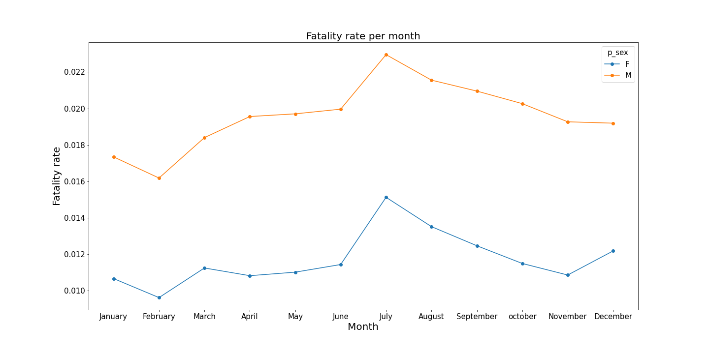
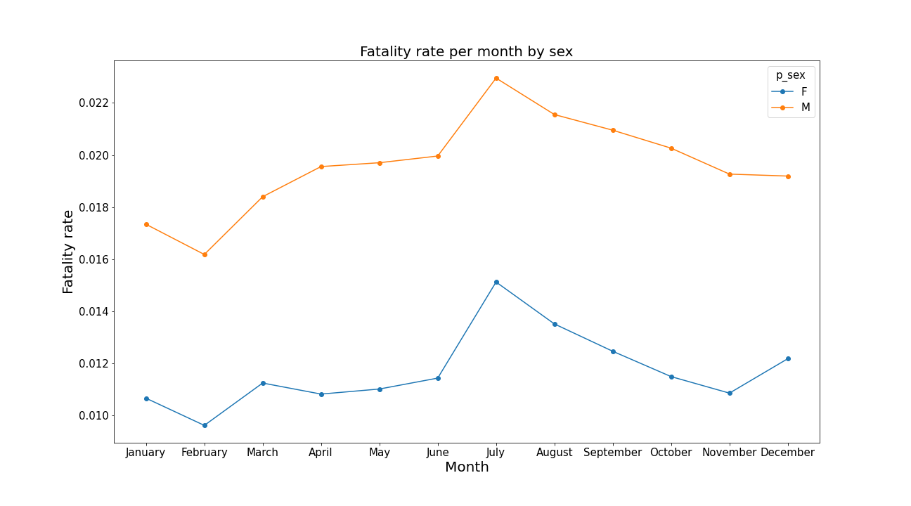
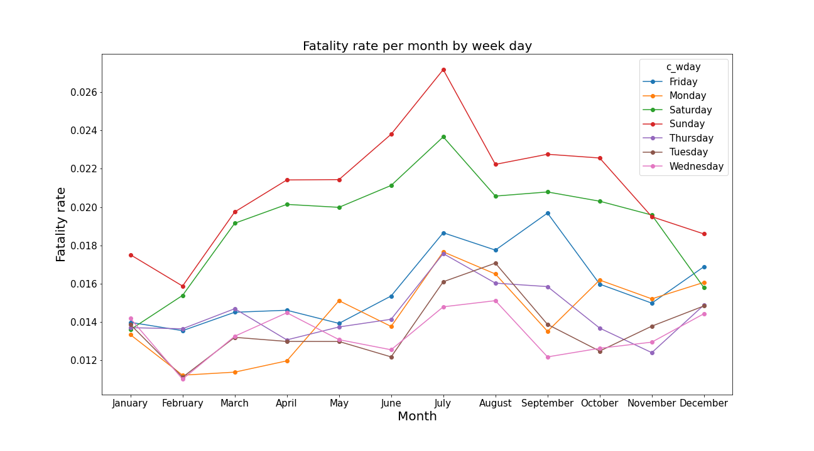

### 2. Fatality rate by collision configuration

- Head on collision caused the most fatality

  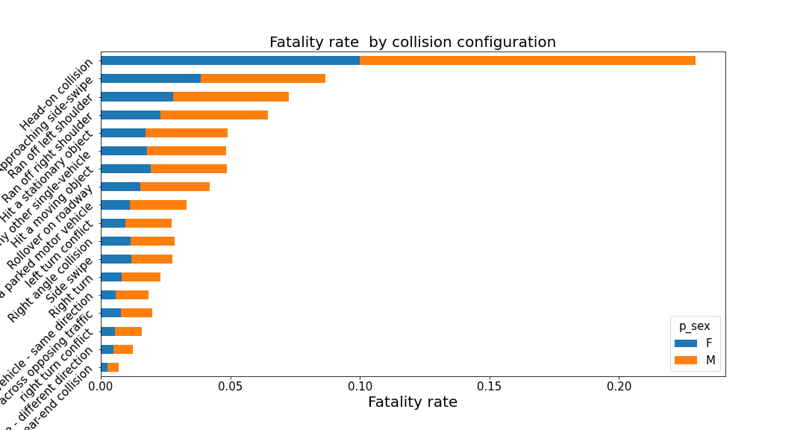
 
### 3. Fatality rate by collision year

- Fatal collisions occurred mostly in the years 1999 & 2006.
- Fatality rate also peaked in July 2003

  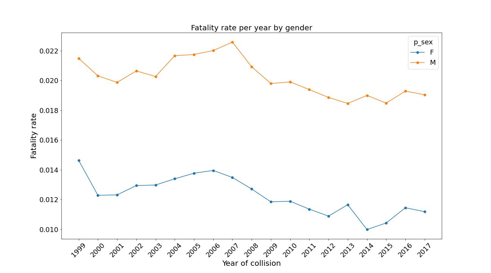
  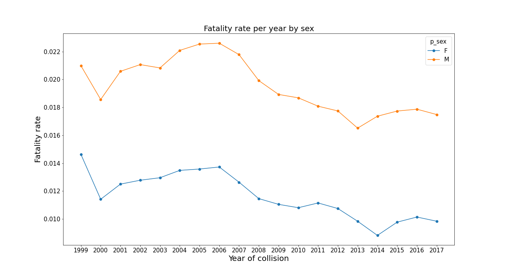
  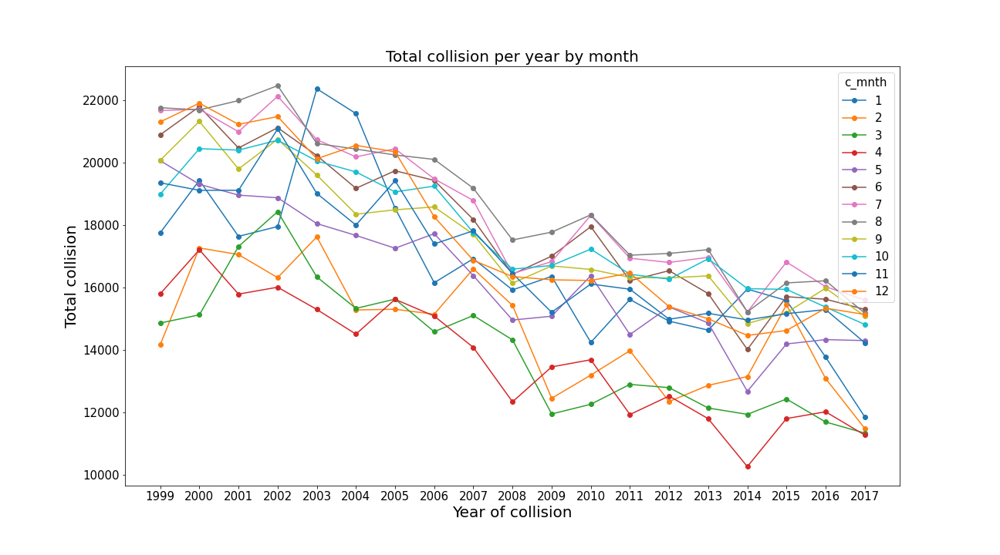

### 4. Fatality rate by collision hour

- Fatal collisions were most likely at 6 p.m. on Sundays.

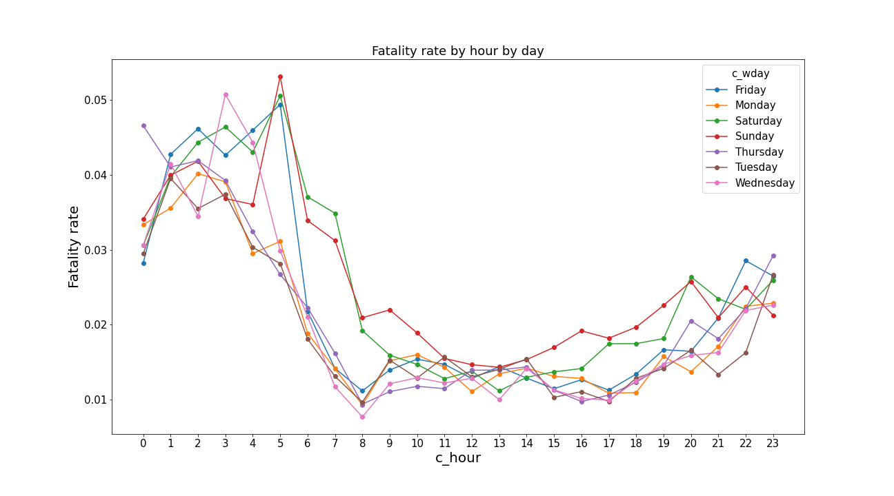
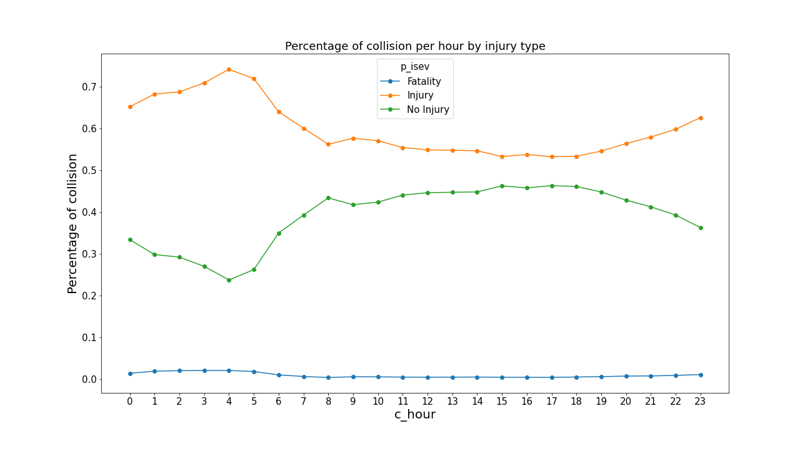

### 5. Total fatality  by vehicle model year

- The light duty 2000s (i.e. 2000-2009) model vehicles are involved in the most fatal collisions and they were driven by mostly males.

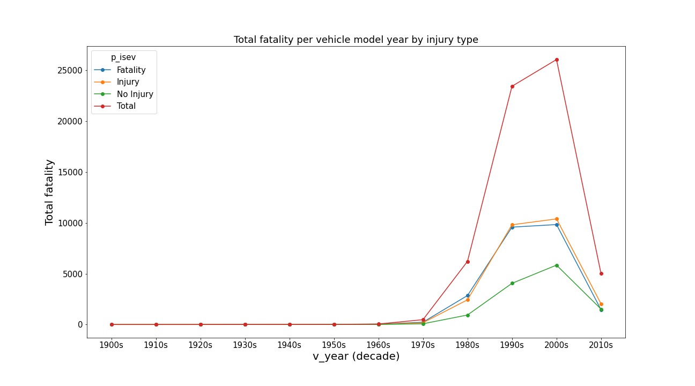
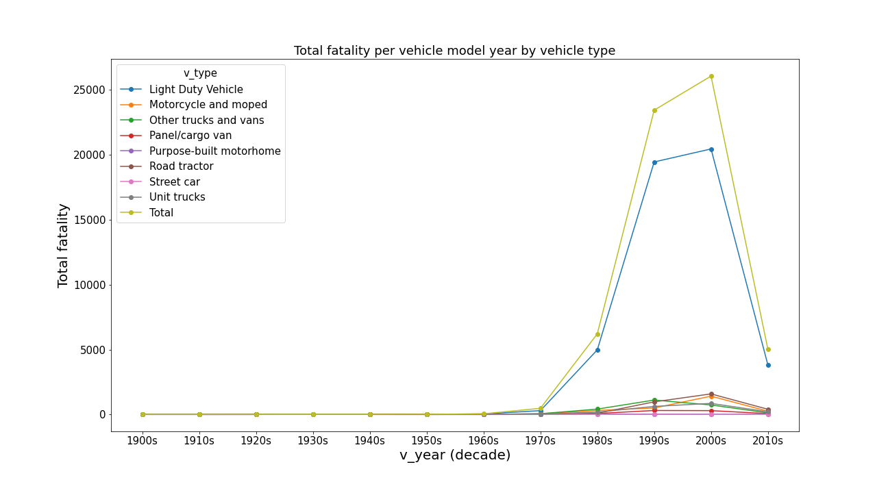
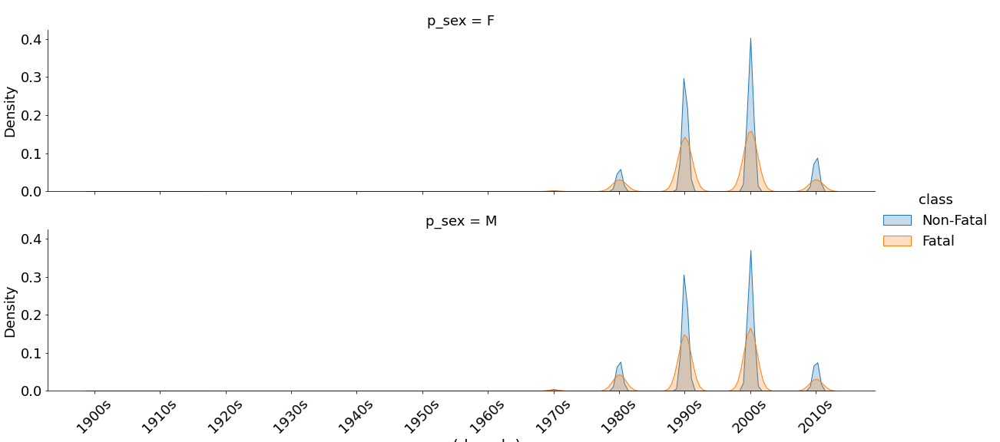

### 6. Fatality rate by age group

- Young people in their 20s (mostly males) are involved in most fatal collisions
- Fatality rate increases with age

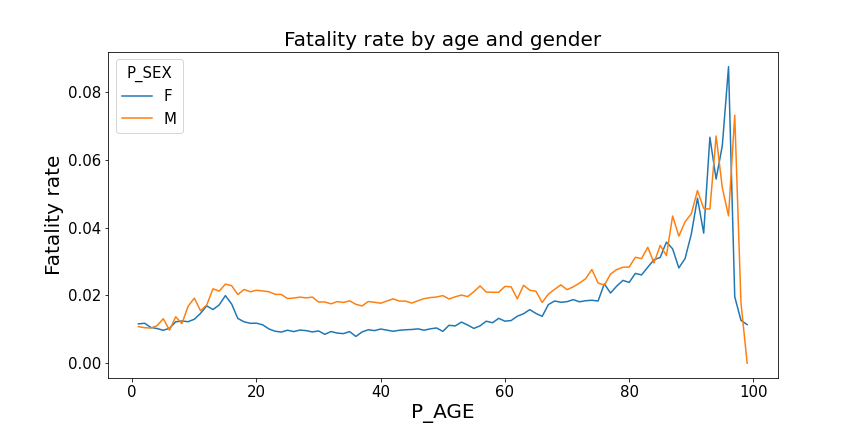
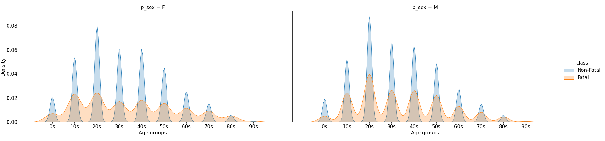

- ## Dimensionality Reduction

The PCA plot of the data is shown below

## Model results on small data set

The result shown below is based on a small sample of the dataset due to lack of computational resources to train on the entire dataset.

