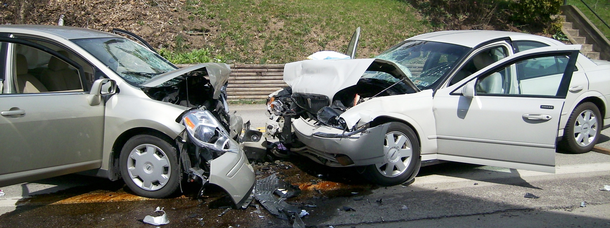
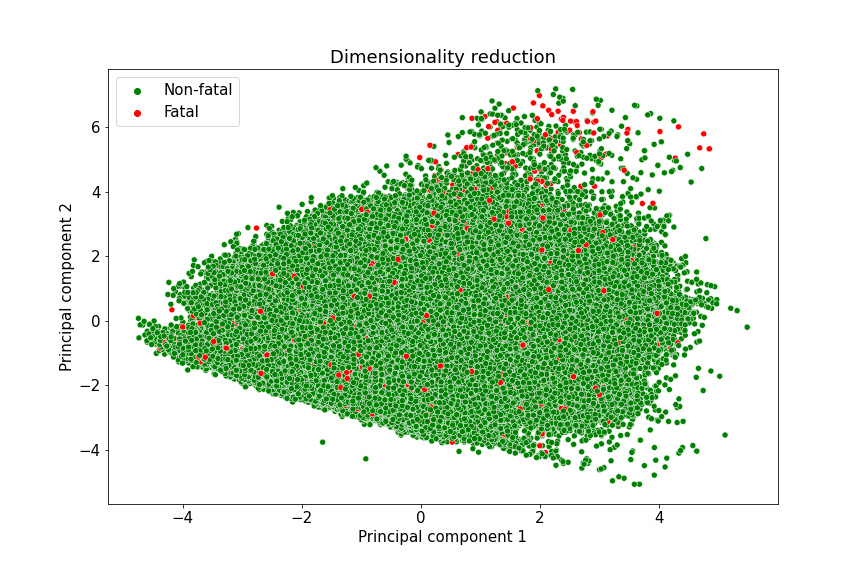
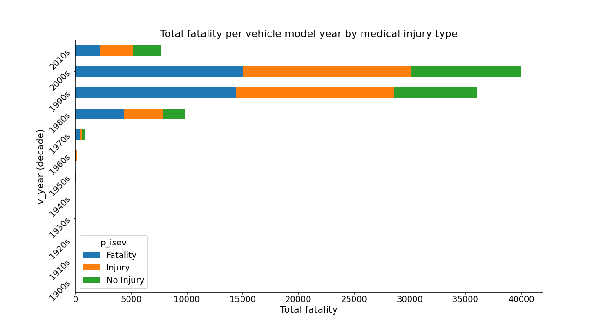
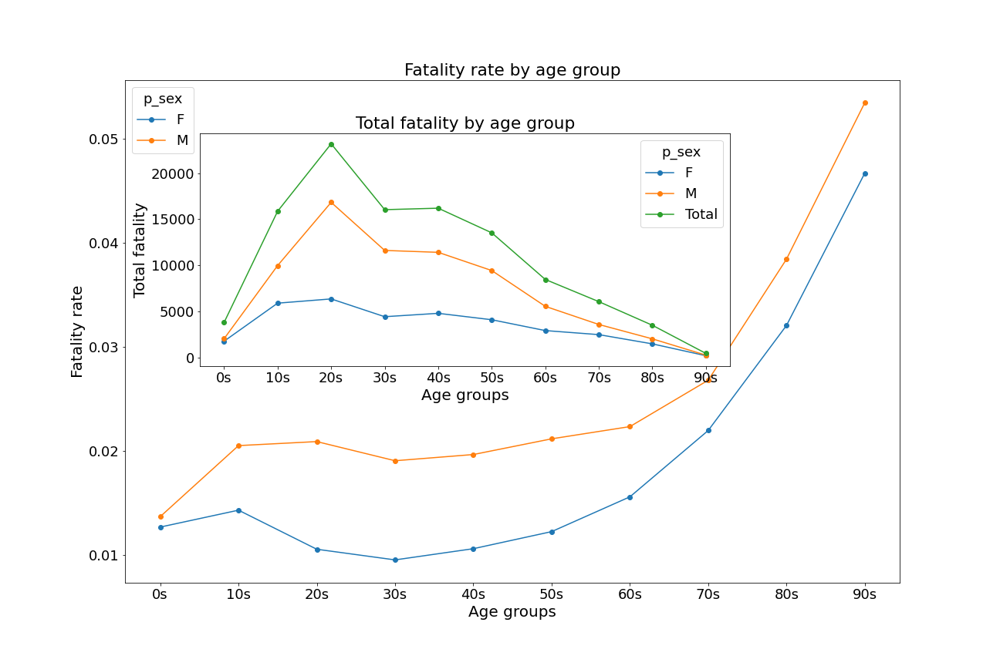

# Canada Motor Vehicle Collisions (1999 - 2017)

In many real-world datasets, class imbalance is a common problem. An imbalanced data set occurs when one class (majority or negative class) vastly outnumbered the other (minority or positive class). The class imbalance problem is manifested when the positive class is the class of interest. We have obtained a real-world dataset of motor vehicle collisions on public roads in Canada, with an inherent imbalanced class problem.

## Dataset Information: [open.canada.ca](https://open.canada.ca/data/en/dataset/1eb9eba7-71d1-4b30-9fb1-30cbdab7e63a)

## Dimensionality Reduction

The PCA plot of the data is shown below

## Exploratory Data Analysis

### 1. Fatality rate by month

- Fatal collisions are most likely in the months of June, July, and August, which are the summer months in Canada.
- Fatal collisions were most likely with limited visibility weather condition in the month of September.
- Fatal collisions occurred mostly on weekends - Sundays & Saturdays.
- Head-on collision caused the most fatality each month.

### 2. Fatality rate by collision configuration

- Head-on collision caused the most fatality

 
### 3. Fatality rate by collision year

- Fatal collisions were most likely in the years 1999 & 2007, and the weather condition was visibility limited.

  
  
  

### 4. Fatality rate by collision hour

- Fatality rate  is high at 5 a.m. on Fridays.
- Most fatal collisions occurred when the weather is clear and sunny.
- Head-on collision caused the most fatality any hour of the day.

### 5. Total fatality by vehicle model year

- Light duty model vehicles in 2000s (i.e. 2000-2009) are involved in most fatal collisions and they were driven by mostly males.

### 6. Fatality rate by age group

- Young people in their 20s (mostly males) are involved in most fatal head-on collisions
- Fatality rate increases as age increases

