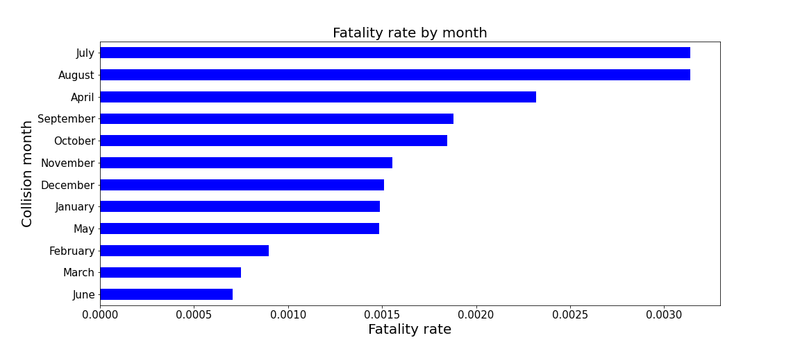
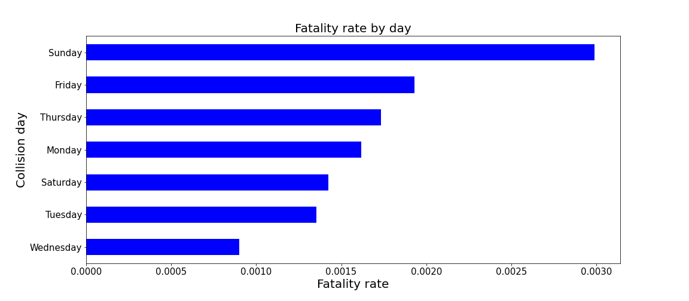
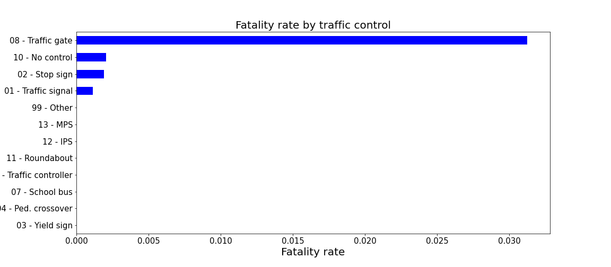

# Ottawa Motor Vehicle Collisions (2013 - 2019)

##  Dataset Information:   [Open Data Ottawa](http://data.ottawa.ca/en/organization/transportationservices)

## Collision Map in Ottawa

The figure shows the collision regions and their classification within Ottawa.

## Fatality Rate

The figures below show the fatality rate by different variables. 

